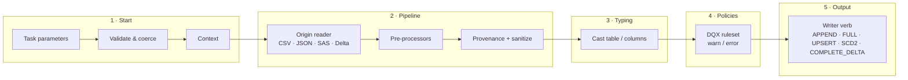

# 00 — Overview

## Purpose

`data_framework` is a configuration-driven data engineering framework for Databricks. It ingests files and tables and promotes them through the medallion layers (Inbound → Bronze → Silver) with typed configuration and explicit contracts between stages. Gold is SQL on top of Silver — see [Gold](#gold).

Onboarding a dataset means writing a workflow YAML. It does not mean writing Python.

A task run is always the same story:

## Design principles

1. **Configuration over code.** A new dataset is onboarded by writing a workflow YAML, never by adding Python. Workflow YAMLs stay flat `key: value` task parameters, so Databricks Asset Bundles and YAML anchors keep working; the Start layer turns them into one validated, typed `Context`.
2. **Layers communicate only via Context + DataFrame.** Each layer is independently testable, replaceable, and ignorant of the others' internals. No layer reads raw parameters — only the typed Context.
3. **Verbs are layer-agnostic.** Any source origin can pair with any write verb whose declared requirements are met. Inbound→Bronze FULL or Bronze→Silver APPEND are configurations, not new code paths. The Start layer validates each origin × verb combination and fails fast with a single aggregated error report.
4. **Fail fast, fail loudly.** Invalid config, unknown origins, and failed `error`-criticality checks stop the task with a clear error. Nothing logs an error and then reports success.
5. **Contracts are explicit.** The Silver metadata columns and the audit log table have fixed, documented shapes that downstream consumers can rely on (see Glossary below).
6. **Extension points, not special cases.** Source-specific behavior — one vendor's JSON envelope, say — lives in named, config-selected pre-processors, never hardcoded in a generic path. Data quality rules are declared in a DQX ruleset file, never in Python.
7. **Deployable as a wheel.** src-layout Python package, built and deployed via Databricks Asset Bundles, executed with `python_wheel_task` entry points. No `sys.path.append`, no logic in notebooks.

## The five layers

| # | Layer | Package | Responsibility |
|---|-------|---------|----------------|
| 1 | **Start** | `data_framework.context` | Load flat task parameters, coerce & validate into a typed `TaskConfig` (pydantic), resolve names/paths, assemble the `Context` (config + Spark session + job/run identity + logger). |
| 2 | **Pipeline** | `data_framework.pipelines` | Produce a DataFrame from the configured origin: CSV, JSON, SAS file (via Auto Loader) or Delta table. Apply named pre-processors, provenance columns, column-name sanitization. |
| 3 | **Typing** | `data_framework.typecast` | Apply the casts the config declares — type plus optional date/timestamp format — and validate that none of them silently produced NULL. Columns the config does not name keep the type they arrived with. |
| 4 | **Policies** | `data_framework.policies` | Gate the dataset on a [Databricks DQX](https://databrickslabs.github.io/dqx/) ruleset: `warn` is logged and passes, `error` refuses the batch. Results go to the audit log. |
| 5 | **Output** | `data_framework.output` | Write the dataset with a verb: APPEND, FULL, UPSERT, SCD2, COMPLETE_DELTA — to Delta tables (implemented) or files (interface specified). |

Cross-cutting: `data_framework.observability` (audit/KPI logging) and `data_framework.entrypoints` (wheel entry points).

## Gold

Gold is SQL, not a verb. The framework's job ends at Silver.

- **One materialized view per Gold table**, in its own `.sql` file, deployed with the bundle.
- **One example ships with the framework:** the current state of a Silver table (`__CURRENT_FLAG = 'Y'`, metadata columns dropped).
- **Everything else is the view's own query** — joins, aggregates, business rules, whatever parameters it needs.
- **Silver never blocks Gold.** A view reads Silver as state, so MERGEs and rewrites are picked up on the next refresh.
- **Disposable.** Drop it and rebuild it from Silver at any time; history lives in Silver.
- **Checked and traced upstream.** The DQX gate and the audit log cover data on its way into Silver, not Gold.

## Glossary

| Term | Meaning |
|------|---------|
| **Context** | The single typed object produced by the Start layer: validated config + Spark session + job/run identity + logger. The only thing layers share besides DataFrames. |
| **Origin** | Where the data comes from: `csv`, `json`, `sas`, `delta`. Determines the Pipeline implementation. |
| **Verb** | How data is written: `append`, `full`, `upsert`, `scd2`, `complete_delta`. Determines the Output implementation. See [03_write_verbs.md](03_write_verbs.md). |
| **Pre-processor** | A named, config-selected DataFrame transform applied by the Pipeline layer right after reading (e.g. `record_envelope`, `flatten_nested`). |
| **Snapshot** | One source export, identified by the timestamp embedded in its file name. COMPLETE_DELTA replays snapshots one by one, in order. |
| **Snapshot scope** | `delta` (source sends only changes) or `full` (source sends the complete dataset each time, so records absent from a snapshot are expired — deletion by omission). |
| **Deletes feed** | An optional secondary source (a Delta table) carrying delete records, merged as soft deletes. Available to COMPLETE_DELTA. |
| **Watermark** | `max(__EXPORT_DATE)` already present in the target; an incremental read processes only source rows newer than it. |
| **Silver metadata contract** | The framework-managed columns: `__FILEPATH`, `__BRONZE_LAST_MODIFIED_DT`, `__SILVER_LAST_MODIFIED_DT`, `__START_DATE`, `__END_DATE`, `__CURRENT_FLAG` (`Y`/`N`), `__DELETED_FLAG` (`Y`/`N`), `__EXPORT_DATE`. |
| **Audit log contract** | Every run logs to `` `monitoring_{env}`.`audit`.`logs` `` with a fixed schema (uuid, job_id, task_id, timestamp, type, catalog, schema, table, name, source, total, description). KPI events use `source="KPI"`. |
| **Medallion layers** | Inbound (raw files on a Volume) → Bronze (raw Delta) → Silver (typed, deduplicated, history-tracked) → Gold (materialized views over Silver, see [Gold](#gold)) → Export (files/outbound). |

## Document map

| Doc | Content |
|-----|---------|
| [01_architecture.md](01_architecture.md) | Layer-by-layer architecture, protocols, execution flow, extension points |
| [02_config_schema.md](02_config_schema.md) | The typed configuration schema, parameter by parameter |
| [03_write_verbs.md](03_write_verbs.md) | Verb semantics with worked examples (incl. COMPLETE_DELTA snapshot replay) |
| [04_policies.md](04_policies.md) | The data quality gate and how the DQX ruleset drives it |
| [05_testing.md](05_testing.md) | Unit and platform testing strategy |
| [06_roadmap.md](06_roadmap.md) | Phased implementation plan and current status |
